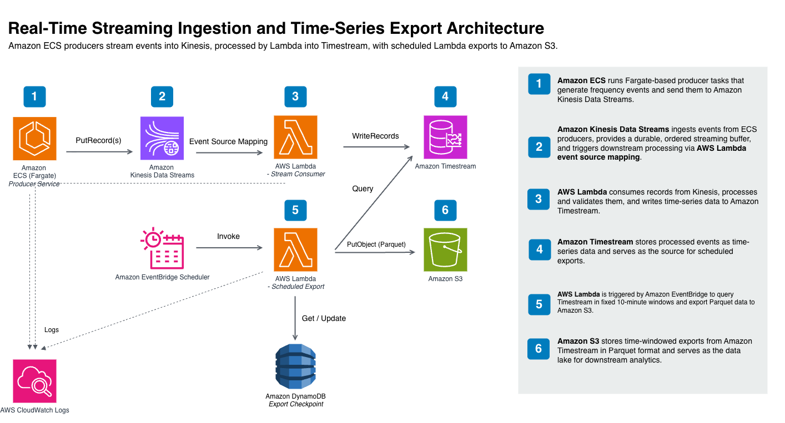
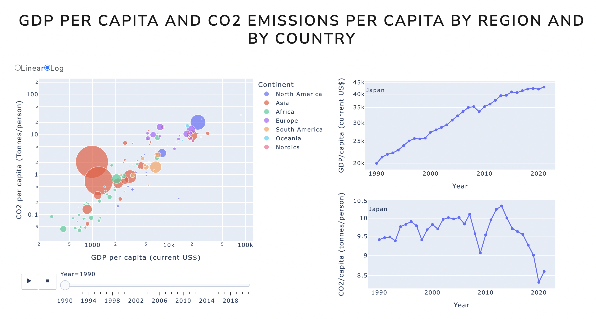
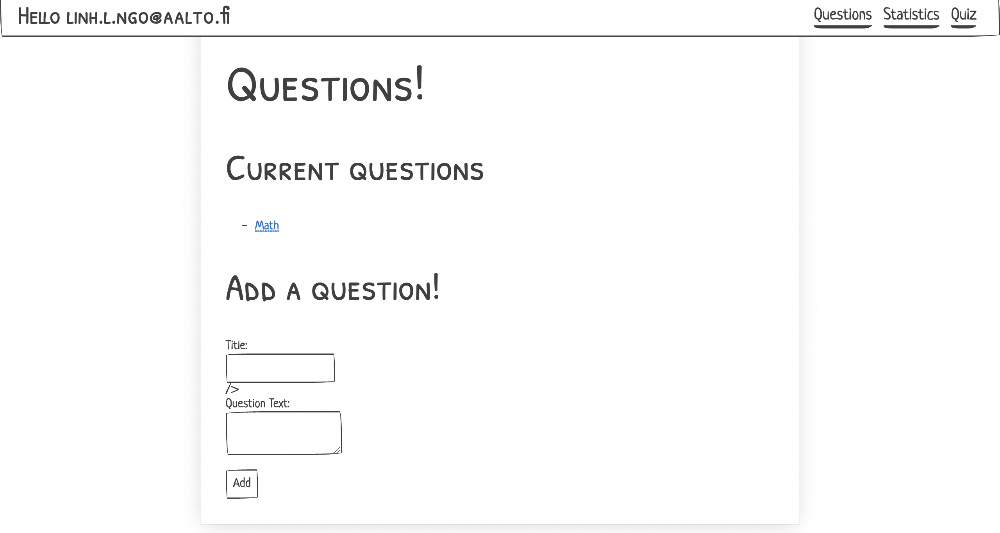
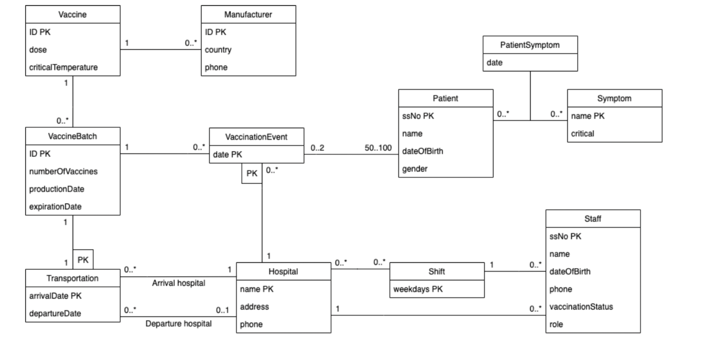



A curated collection of projects spanning **data engineering**, **analytics platforms**, **cloud architectures**, and **full-stack applications**.

I focus on **production-oriented design**: scalability, reliability, observability, and clear data modeling — from real-time streaming systems to serverless pipelines and interactive data products.

---

## 📈 Data Platform for Detecting Trading Trends in Financial Tick Data
**Apache Flink · Kafka · InfluxDB · Grafana · Python · Java · Docker**

**Impact:**  
Real-time analytics on high-volume financial tick data, generating trend indicators and trading signals in **seconds instead of hours**.

**What I built**
- Stream ingestion using **Apache Kafka** with event-time processing.
- Low-latency analytics and windowed computations in **Apache Flink**.
- Time-series persistence in **InfluxDB** for fast queries and retention control.
- Interactive **Grafana dashboards** for monitoring trends and indicators.

🔗 **Links:**  
[GitHub](https://github.com/dogaturkseven/CS-E4780_course_project) ·  
[Technical Report](/files/FinancialDataPlatformReport.pdf)

---

## 📦 Parcel Delivery Quality Data Pipeline
**Azure Databricks · Delta Lake · Delta CDF · Apache Spark · Python · Medallion Architecture**

**Impact:**  
Scalable, incremental analytics pipeline enabling reliable KPI reporting for parcel delivery quality monitoring.

**What I built**
- End-to-end data pipeline using **Bronze–Silver–Gold** architecture.
- Incremental data processing with **Delta Change Data Feed (CDF)**.
- Optimized Gold-layer tables for performance and analytical workloads.
- Checkpointing and fault-tolerant Spark jobs on **Azure Databricks**.

🔗 **Links:**  
[GitHub](https://github.com/ngol4/Parcel-quality-pipeline-cdc)

---

## ☁️ Serverless AWS Data Pipeline Architecture
**AWS CDK · Lambda · Glue · Step Functions · S3 · Athena · Python · SQL**

**Impact:**  
Fully serverless analytics pipeline with **automatic scaling**, **fault tolerance**, and **pay-per-use cost efficiency**.

**What I built**
- Infrastructure as Code using **AWS CDK**.
- Event-driven ingestion and validation with **AWS Lambda**.
- Data transformation via **AWS Glue**, orchestrated by **Step Functions**.
- Analytics and reporting using **Amazon Athena** over S3 data lakes.

🖼️ **Architecture**

🔗 **Links:**  
[GitHub](https://github.com/ngol4/serverless-aws)

---

## 🗂️ Kanban Board Application
**Scala · ScalaFX · UML · Unit Testing · JSON · Git**

**Impact:**  
Desktop task-management application inspired by Kanban principles for visual workflow tracking.

**What I built**
- Kanban board UI using **ScalaFX**.
- Task state management with persistent JSON storage.
- UML-driven design and unit-tested core logic.
- Emphasis on usability and real-time task updates.

🖼️ **UI Preview**

🔗 **Links:**  
[GitHub](https://github.com/ngol4/KanbanBoard)

---

## 🌍 Climate Change Communication Website
**Python · Data Analysis · Visualization · Dash · Heroku**

**Impact:**  
Interactive data product communicating greenhouse gas emission trends to Nordic audiences.

**What I built**
- Data exploration and cleaning of global emissions datasets.
- Interactive visualizations showing **GDP per capita vs CO₂ emissions**.
- Dash-based web application deployed on **Heroku**.
- Collaboration in a **5-person team** as part of a university data science project.

🖼️ **Visualization**

🔗 **Links:**  
[Live Website](https://team2ghgemissions.herokuapp.com/)

---

## 🧠 Quiz Application (Full-Stack Web App)
**JavaScript · HTML · CSS · Deno · Oak · PostgreSQL · Heroku**

**Impact:**  
Three-tier web application for creating and answering multiple-choice quizzes via UI and API.

**What I built**
- REST API using **Deno + Oak**.
- PostgreSQL-backed persistence layer.
- Client-side UI for quiz creation and participation.
- Deployed full stack on **Heroku**.

🖼️ **Application UI**

🔗 **Links:**  
[GitHub](https://github.com/linhlngo/Quiz-app) ·  
[Live Website](https://wsdquestion.herokuapp.com/)

---

## 💉 Vaccination Database Design
**SQL · Python · UML · Data Normalization · Relational Databases**

**Impact:**  
Normalized relational database system for managing vaccination, patient, and doctor records.

**What I built**
- Conceptual and logical design using **UML**.
- Data normalization and schema optimization.
- Data ingestion and transformation with **Python**.
- Team collaboration (4 members) for database design and implementation.

🖼️ **Database Design**

🔗 **Links:**  
[GitHub](https://github.com/ngol4/Vaccination-Database/tree/master)

---

## 🧬 Machine Learning for Personalized Treatment Decision-Making
**Causal Inference · Reinforcement Learning · Healthcare Analytics · Research**

**Impact:**  
Bachelor’s thesis analyzing machine-learning approaches for personalized and dynamic treatment strategies in healthcare.

**Focus**
- Individualized Treatment Effect (ITE) estimation via **causal inference**.
- **Reinforcement learning** for optimal dynamic treatment regimes.
- Comparison of objectives, data sources, evaluation methods, and limitations.
- Discussion on interpretability, trust, and hybrid causal-RL approaches.

📄 **Thesis:**  
[PDF on Google Drive](https://drive.google.com/file/d/1PR71OHlwtLDPFWh3UiocvFZpDraEXcfx/view)

---

## 📫 Contact
If you’d like to discuss any of these projects, collaboration opportunities, or research ideas, feel free to reach out.
